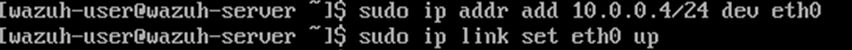
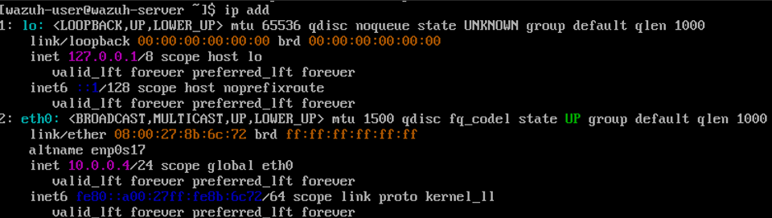
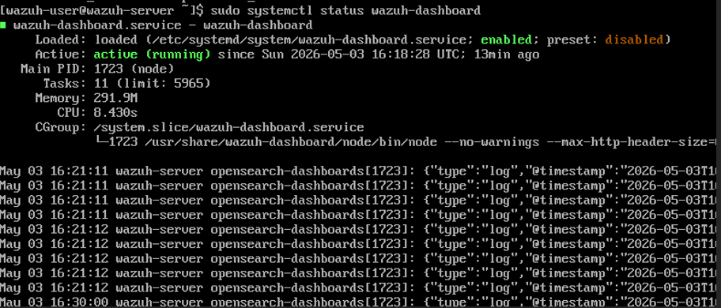
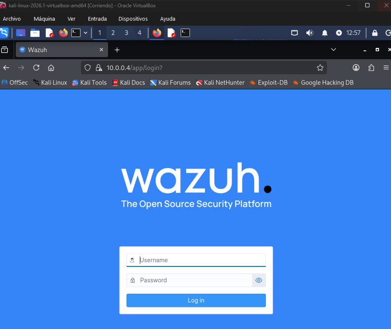
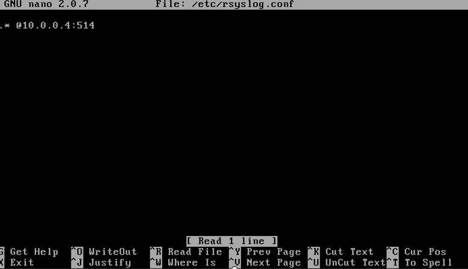
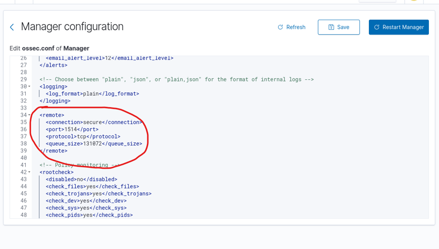
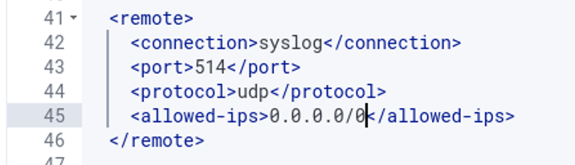
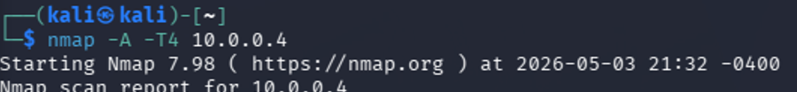
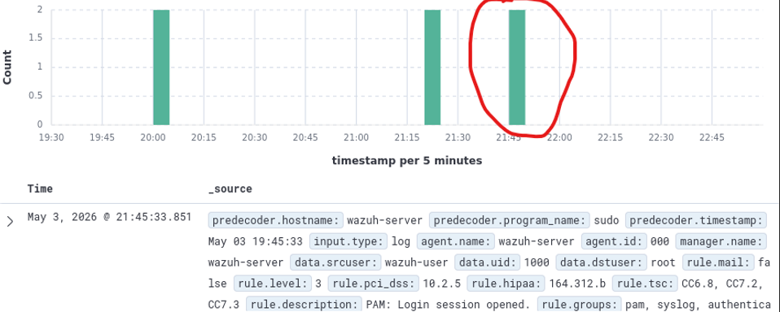
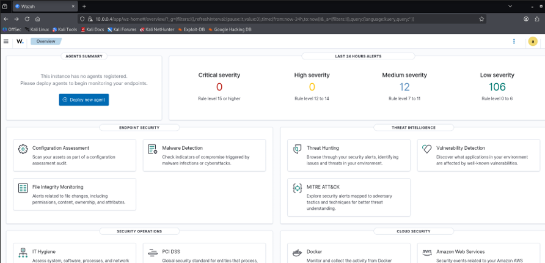

# 🛡️ Implementación de SIEM Wazuh para Monitorización de Sistemas Legacy

## 📋 Descripción
Este proyecto demuestra la implementación de un entorno de monitorización de seguridad (SIEM) utilizando **Wazuh** para supervisar activos vulnerables y antiguos (**Metasploitable 2**), donde no es posible instalar agentes modernos debido a limitaciones de compatibilidad del sistema operativo.

## 🏗️ Arquitectura del Laboratorio
Para este entorno se han configurado tres máquinas virtuales en una red aislada:
- **Atacante:** Kali Linux (10.0.0.1)
- **Defensa (SIEM):** Wazuh Manager (10.0.0.4)
- **Víctima (Legacy):** Metasploitable 2 (10.0.0.5)
  
#### ⚙️ Configuración de IP inicial en Wazuh Server  

#### ✅ Verificación de IP 10.0.0.4 en Wazuh Server

#### 🖥️ Verificación del estado de Wazuh Dashboard

> **Nota técnica:** En la captura superior se observa el flujo de logs de OpenSearch en formato JSON. Estos registros confirman la correcta sincronización entre el indexador y la interfaz visual, garantizando que las alertas generadas por Metasploitable 2 se visualicen sin retraso (latencia mínima).

## 🛠️ Desafío Técnico: Monitorización Sin Agente

#### 🌐 Acceso a la Interfaz Web de Wazuh

#### ⚙️ Configuración del reenvío de logs en Metasploitable 2

> **Explicación:** Se utilizó el editor `nano` para añadir la instrucción `*.* @10.0.0.4:514`. Esto indica al sistema legacy que envíe **todos** los logs (`*.*`) al servidor Wazuh (`10.0.0.4`) a través del puerto estándar `514`.

### 🛠️ Configuración en el Wazuh Manager (ossec.conf)

Para que el servidor acepte los logs remotos, fue necesario habilitar el recolector de **Syslog** dentro del archivo de configuración principal del Manager.

#### 1. Identificación del protocolo remoto

> **Análisis:** Por defecto, el bloque `<remote>` está configurado para conexiones seguras de agentes en el puerto `1514/TCP`. Dado que los sistemas legacy no soportan el agente moderno, debemos habilitar un canal estándar.

#### 2. Habilitación del puerto de escucha Syslog (UDP/514)

> **Implementación:** Se añadió un nuevo bloque de configuración especificando:
> * **Connection:** `syslog` (permite la recepción de logs sin necesidad de agente).
> * **Port:** `514` (el puerto estándar para tráfico de logs).
> * **Protocol:** `udp` (elegido por su baja sobrecarga en sistemas antiguos).
> * **Allowed-ips:** `0.0.0.0/0` (en este entorno de laboratorio, permite recibir tráfico de toda la subred configurada).

El reto principal fue establecer visibilidad sobre un sistema "Legacy" que no soporta el agente de Wazuh actual.
- **Solución:** Configuración de un canal de comunicación vía **Syslog (UDP/514)**.
- **Configuración en Víctima:** Se redirigieron todos los logs del sistema hacia el SIEM mediante la edición del archivo `/etc/rsyslog.conf`.

## 🔍 Caso de Estudio: Autoprotección del SIEM (HIDS)

### 1.1 El Incidente (Escaneo Nmap)
Durante las pruebas de estrés, se realizó un escaneo agresivo sobre la IP `10.0.0.4`.

### 1.2 Detección de Anomalía
El servidor detectó un pico inusual de actividad en los logs, demostrando su capacidad como **Host-based Intrusion Detection System (HIDS)** incluso cuando el objetivo es él mismo.

Agente: wazuh-server (ID: 000). Esto indica que la alerta se generó internamente en el servidor.

Nivel de Regla (Rule Level): En la captura se observa un Nivel 3, pero durante un Nmap agresivo, este nivel escala según los scripts NSE que se activen.

Descripción de la regla: En el log detallado vemos PAM: Login session opened y actividades de sudo. Esto es porque Nmap, al intentar conectar con scripts agresivos, dispara eventos de autenticación y acceso al sistema.

## ⚠️ Análisis de Incidentes y Hallazgos

#### 📊 Dashboard de Seguridad: Visualización de Eventos

> **Evidencia técnica:** En el panel superior se observa que, aunque no hay agentes instalados (0 agents registered), el SIEM ya ha procesado **12 alertas de severidad media** y **106 de severidad baja**. Esto confirma que la ingesta de datos vía Syslog desde el sistema Legacy es exitosa y permite iniciar el análisis de comportamiento.
> 
Durante las pruebas de intrusión con **Nmap**, se identificó un comportamiento crítico:
1. **Saturación del Servicio:** Un escaneo agresivo (`-A`) provocó la saturación momentánea del demonio de registro en la víctima.
2. **Detección de Continuidad:** Wazuh detectó y alertó sobre el reinicio del servicio `syslogd` (Alerta Nivel 5), evidenciando un impacto directo en el sistema monitorizado tras un escaneo de red de alta intensidad.

---

## 🚀 Conclusión
Este laboratorio demuestra mi capacidad para:
- Configurar arquitecturas de red seguras y monitorización centralizada.
- Solventar limitaciones de compatibilidad en sistemas antiguos mediante protocolos estándar (Syslog).
- Analizar logs de sistema para identificar anomalías de seguridad incluso ante la ausencia de firmas específicas de ataque.
